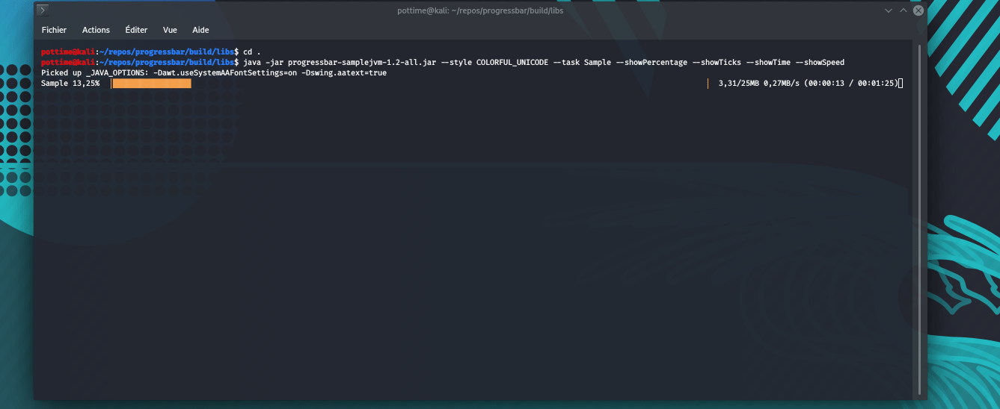

# progressbar


Terminal-based progressbar for Kotlin multiplatform

## Preview


## Targets
For the moment, only JVM is available. Because coroutines are only available on the main thread in Kotlin Native.

## Installation
The library is available on jcenter and jitpack. JCenter provides only stable releases whereas jitpack provide releases and snapshots.

```kotlin
repositories {
    jcenter() // Releases only
    maven("https://jitpack.io") // Releases and snapshots
}
```

## Usage
The usage is very straightforward

```kotlin
ProgressBar(ticks = 0, maxTicks = 100).use { progressBar -> // ProgressBar.close() interrupt the threads
    progressBar.tick() // Increment ticks by 1
    progressBar.tickBy(10) // Increment ticks by 10
    progressBar.tickTo(100) // Set ticks to 100
}
```

### Style
The styles let you make the progressbar nicer

* `COLORFUL_UNICODE` ansi colors and unicode characters
* `UNICODE` unicode characters
* `ASCII` ascii characters

```kotlin
ProgressBar(ticks = 0, maxTicks = 100, style = ProgressBarStyle.COLORFUL_UNICODE).use { progressBar ->
    // ...
}
```

See preview above

### Unit
While processing or downloading data, it can be a good idea to provide the unit.

```kotlin
// Note : the ticks are in KB
ProgressBar(ticks = 0, maxTicks = 100, unit = ProgressBarUnit.KB_TO_MB).use { progressBar ->
    // The ticks will be automatically converted from KB to MB
}
```

See preview above

For a custom unit, you can create your own ProgressBarUnit: `ProgressBarUnit(unitName, unitSize)`

### Task name
You can add text at the beginning of the progress bar, with the `task` parameter.

```kotlin
ProgressBar(ticks = 0, maxTicks = 100, task = "Text").use { progressBar ->
    // ...
}
```

See preview above
